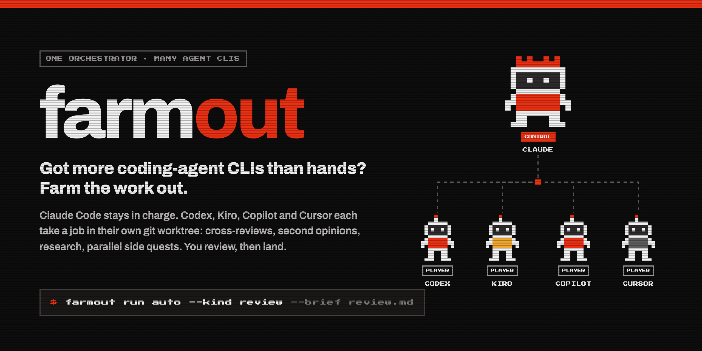
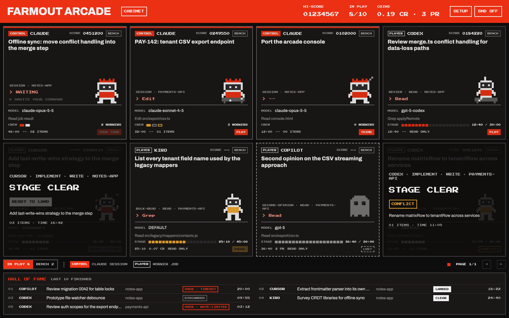
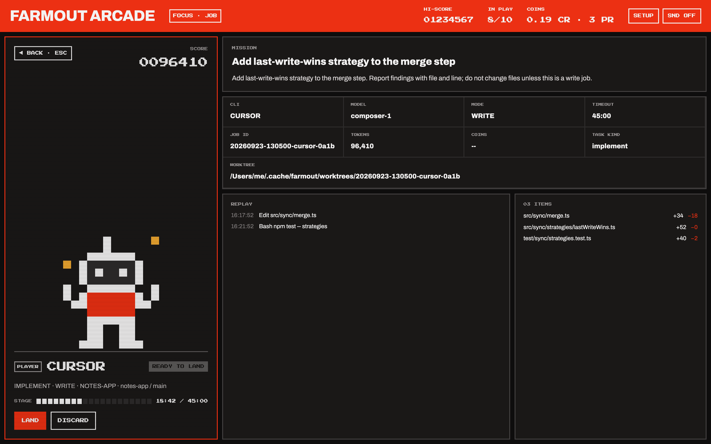
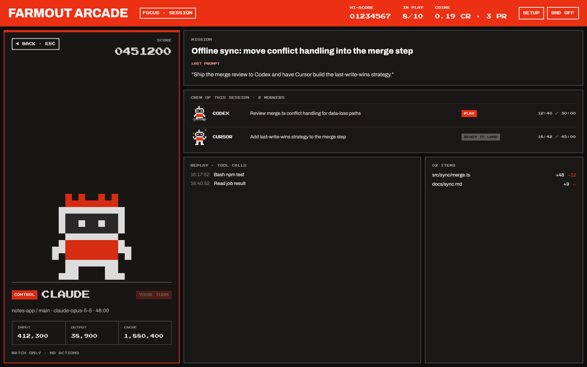
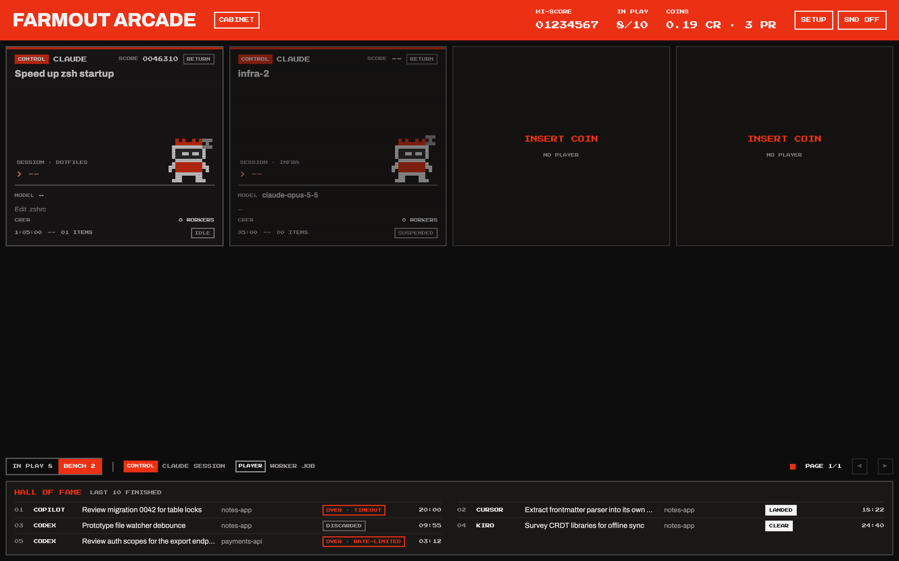
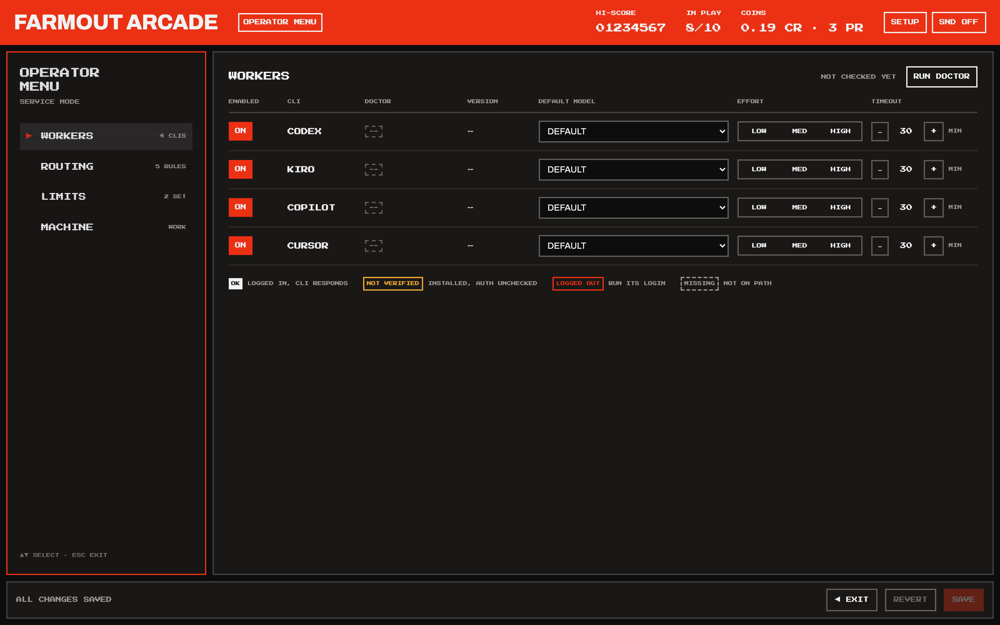

<p align="center"></p>

# farmout

**You pay for Codex. And Kiro. And Copilot. And Cursor. You still only use one of them at a time.**

`farmout` lets one agent run the others. [Claude Code](https://claude.com/claude-code) stays the orchestrator and farms work out to your other coding-agent CLIs. Each job runs headless in its own git worktree while Claude keeps working. When a job finishes, Claude reviews the result, and a patch reaches your checkout only when you land it.

- **Cross-review for real.** Have Codex review what Claude wrote, and Copilot give a second opinion on Codex's review. The workers are different models trained by different companies, so their blind spots differ too.
- **Isolated by default.** Every job gets its own worktree, cut from a snapshot of your repo. Nothing touches your checkout until you `land` it, and then only as uncommitted changes.
- **Watched, not hoped for.** Jobs run in the background. farmout detects a stalled job by the absence of real agent events, so a login spinner that keeps writing to the log still counts as a stall. It also recovers partial output from a killed job.
- **An arcade for your agents.** `farmout arcade` opens a local dashboard. Every Claude session and every farmed-out job appears as a player, with KILL / LAND / DISCARD buttons and a Hall of Fame.
- **Plain bash, jq and Python's standard library.** No daemon, no pip packages, no npm install.

```
$ farmout run auto --kind review --brief review.md
20260924-104827-codex-0a53
farmout: 20260924-104827-codex-0a53 repo=payments-api base=3f9c2e1 mode=read
...
20260924-104827-codex-0a53 ok
$ farmout result 20260924-104827-codex-0a53
src/export/csv.ts:88 - the stream is never closed on the error path - ...
```

## Install

**One command** installs the CLI to `~/.local/bin/farmout`, links the Claude Code skill, and checks which agent CLIs you have:

```bash
curl -fsSL https://raw.githubusercontent.com/tp9imka/farmout/main/install.sh | bash
```

**Or as a Claude Code plugin**, from inside Claude Code:

```
/plugin marketplace add tp9imka/farmout
/plugin install farmout@farmout
```

**Or from a clone:** `git clone https://github.com/tp9imka/farmout && cd farmout && ./install.sh`

Requirements: `git`, `jq`, `perl`, `python3` (3.9+), and at least one worker CLI: [`codex`](https://github.com/openai/codex), [`kiro-cli`](https://kiro.dev/docs/cli/), [`copilot`](https://github.com/github/copilot-cli) or [`cursor-agent`](https://docs.cursor.com/en/cli/overview), installed and logged in. The installer never installs system packages; it tells you what's missing. Tested on macOS; Linux runs in CI.

```
$ farmout doctor
codex    ok            codex-cli 0.155.1
kiro     ok            kiro-cli 2.21.2
copilot  not-verified  GitHub Copilot CLI 1.0.88
cursor   logged-out    2026.09.10
```

## Use it

Talk to Claude Code the way you'd talk to a lead:

> *"Farm out a review of this diff to codex, and get a second opinion from copilot."*
> *"Have kiro read the legacy mappers and list every tenant field, while we keep going on the endpoint."*
> *"Cross-review the plan: codex and cursor, independently."*

The skill does the rest. It writes a self-contained brief (the worker sees nothing of your conversation), launches the job in the background, and watches it for stalls. Then it checks the worker's claims against the code before relaying them, and asks before landing anything.

Or drive it yourself:

| Command | What it does |
|---|---|
| `farmout run <cli\|auto> --brief task.md` | Start a job. `auto --kind review\|bulk-read\|research\|implement\|second-opinion` picks the CLI by your routing rules, falling back if one is logged out. |
| `farmout run ... --write` | Let the worker change files. The result comes back as a patch. |
| `farmout status` / `result <id>` / `progress <id>` | Watch jobs, read the final message and diffstat, and see real progress events. |
| `farmout land <id>` / `discard <id>` | Apply the patch as uncommitted changes, or throw it away. |
| `farmout kill <id>` / `clean --mine` | Stop a job, or tidy up finished ones. |
| `farmout rate <id> 5/6` / `scores` | Record how many of a worker's claims held up, and see which CLI is actually good at what. |
| `farmout arcade` | The dashboard. Add `--demo` for a sample board. |

Useful flags on `run`:
- `--ref <rev>`: snapshot a pinned commit instead of your dirty working tree.
- `--repo <path>`: take the snapshot from another repo.
- `--no-repo`: run a pure research job with no code.
- `--with <file>`: include untracked files in the snapshot.
- `--out <glob>`: hand back report files from a read-only job.
- `--queue`: wait for a free slot instead of failing at the job cap.
- `--timeout`, `--model`, `--effort`: per-job overrides.

**[Usage scenarios →](docs/scenarios.md)** cross-review, second opinions, bulk reading, web research, parallel implementation, audits that return a report, fan-out with a queue.

## The arcade

`farmout arcade` serves a local dashboard (127.0.0.1 only, with a token in the URL). Claude sessions are **CONTROL** tiles and farmed-out jobs are **PLAYER** tiles, packed controllers first. Suspended and idle sessions move to the **BENCH** tab.



| A job, ready to land | A session and its crew |
|---|---|
|  |  |

| The bench | Setup: workers, routing, limits |
|---|---|
|  |  |

Try it without running anything: `farmout arcade --demo`.

## How it works

1. **Snapshot.** `run` records your repo's state: HEAD plus your uncommitted edits, or exactly `--ref`. It stores this as a commit authored by `farmout@localhost`, so it never shows up as your work.
2. **Worktree.** The job gets a fresh git worktree of that snapshot. The worker CLI runs there headless, fully auto-approved, in its own process group, under a timeout.
3. **Watch.** Stall detection reads each CLI's structured event stream: messages, reasoning, and tool calls starting or finishing. A silent tool call is a long-running tool, not a stall.
4. **Review.** A read job returns its final message, plus any `--out` files. A write job also returns `diff.patch`. The skill tells Claude to verify worker claims before repeating them. Worker output is a lead, not a finding.
5. **Land.** `land` applies the patch to your checkout as uncommitted changes, all or nothing. If you've since edited the same lines, it refuses and keeps the worktree so you can merge by hand.

**Be clear-eyed about one thing:** workers run with approvals off. A worktree is the boundary only while the worker stays inside it. farmout prepends ground rules to every brief (stay in your directory; if the repo doesn't match the brief, say so instead of hunting for the right one). But it is not a sandbox. Farm out to CLIs you trust with your machine.

## Configure

Optional. `~/.config/farmout/config.json`, also editable from the arcade's SETUP screen:

```json
{
  "workers": {
    "codex":  { "enabled": true, "effort": "high", "timeout_min": 30 },
    "kiro":   { "enabled": true, "timeout_min": 20 },
    "cursor": { "enabled": false }
  },
  "routing": [
    { "kind": "review",   "prefer": "codex", "fallback": "copilot" },
    { "kind": "research", "prefer": "codex", "fallback": "kiro" }
  ],
  "limits": { "stall_min": 10, "max_jobs": 4 }
}
```

Built-in routing when there's no `routing` key: review => codex, bulk-read => kiro, research => kiro, implement => cursor, second-opinion => copilot, each with a fallback. Jobs live in `~/.cache/farmout` (override with `FARMOUT_HOME`).

## Uninstall

```bash
~/.local/share/farmout/install.sh --uninstall   # removes the links and the clone; keeps your jobs and config
```

## Develop

```bash
bash tests/run.sh                                       # CLI, against a fake worker
cd arcade && python3 -m unittest discover -s tests -q   # dashboard server and models
cd arcade && node --test 'tests/js/*.test.mjs'          # dashboard view logic
```

No test spends a subscription. `tests/smoke-real.sh` does, on purpose, when you want to check the real CLIs.

## License

MIT. The dashboard bundles Preact + htm (MIT), Press Start 2P and Archivo (SIL OFL). Licenses are in `arcade/static/vendor/`.
